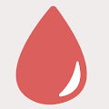
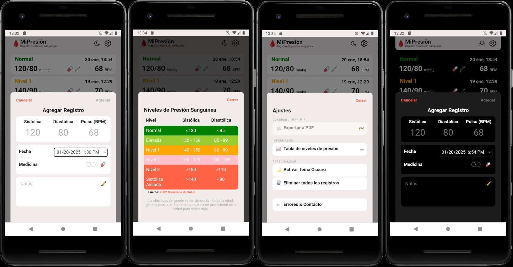

#  Registro de presión sanguínea

## 🛠 Herramientas y recursos utilizados:

- [Conversor de PX a REM](https://nekocalc.com/es/px-a-rem-conversor)
- [Photopea](https://www.photopea.com/)
- [Flaticon](https://www.flaticon.com/)

## 💅🏻 Capturas:

## 🏁 Posibles agregados:

- [ ] Agregar opción para cambiar de idioma entre inglés y español

- [ ] Agreagr filtro por fecha / rango de fechas

- [ ] Agregar calendario

- [ ] Agregar tablero con estadísticas

- [ ] Agregar posibilidad de modificar valores de los niveles

## 📝 Pendientes:

- [ ] Hacer sección "Exportar a PDF"

- [ ] Agrupar listado por fecha

## 👷🏻‍♂️ Trabajando:

- [ ] Agregar color de fondo al hover sobre los medios de contácto en About

## ✅ Completado:

- [x] Agregar screenshots

- [x] Poner nombre: MiPresión (Actualizar header)

- [x] Agregar posibilidad de borrar todos los registros

- [x] Hacer sección "Errores y Contácto" con opciones de donación

- [x] Corregir estilo de íconos en Settings para que tengan el mismo ancho

- [x] Implementar CSS Modules en Log y Header, ToggleTheme, SettingIcon, Logo

- [x] Usar variables CSS en todos los CSS

- [x] Reemplazar px por rem en todos los CSS

- [x] Corregir colores de dark mode

- [x] Implementar CSS Modules en Log y Header, ToggleTheme, SettingIcon, Logo

- [x] Actualizar imports relativos con imports de ruta con @ en Settings

- [x] Hacer refactor para mejorar código en App.tsx con respecto a lógica de modales

- [x] Hacer mensaje para cuando no se crearon registros

  - [x] Eliminar mock data y su dependencia

- [x] Hacer versión responsive

- [x] Hacer sección "Ajustes"

- [x] Corregir problema con el botón de agregar, que en cualquier otra resolución se va muy a la derecha y abajo

- [x] Hacer sección "Niveles de presión arterial"

- [x] Corregir problema con scroll luego de agregar o editar un registro, la lista de logs queda scrolleada

- [x] Corregir hora por defecto al crear un log, aparece desfazada 3 horas por lo menos

- [x] Hacer sección "Agregar"

- [x] Hacer sección "Editar"

- [x] Agregar configuración para importaciones absolutas "@/components/myComponent"

- [x] Íconos de píldora y lápiz con bordes negros para el tema light

- [x] Contexto para el tema

- [x] Div que envuelva a los íconos de píldora y lápiz, junto con los datos del pulso, para que los íconos queden siempre pegados a la derecha

- [x] Guardado de datos en localStorage

- [x] Usar Vite: npm create vite

