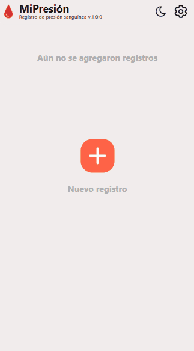

# 🩸MiPresión

- Registro de presión sanguínea

---

<p align="center">
    <a href="https://jonatandb.dev.ar/MiPresion/">
        
    </a>
</p>

## 🚀 Sitio Web

[https://jonatandb.dev.ar/MiPresion/](https://jonatandb.dev.ar/MiPresion/)

---

## 👩🏻‍💻 Tecnologías usadas

- React
- Vite
- TypeScript
- CSS Modules

---

## Ejecutar localmente

Clonar el proyecto

```bash
  git clone https://github.com/Jonatandb/MiPresion
```

Ir al directorio del proyecto

```bash
  cd MiPresion
```

Instalar dependencias

```bash
  pnpm install
```

Crear el archivo `.env.development` usando `.env.example`.

Iniciar el servidor

```bash
  pnpm run dev
```

Visitar:

- http://localhost:5173

---

## Generación de versión productiva para Github Pages

Crear el archivo `.env` usando `.env.example`.

Ejecutar

```bash
  npm run build
```

O bien `build-dev` para verificar el build:

```bash
  npm run build-dev
```

- Requiere el archivo `.env.development`

---

# 🧭 Roadmap

## 🏁 Posibles agregados:

- [ ] Agregar calendario que indique en que fechas se registraron mediciones
- [ ] Agregar tablero con estadísticas
- [ ] Que desde Ajustes se pueda especificar el país de origen y que la tabla de niveles (y los niveles mostrados en los registros) se muestre de acuerdo a dicho país.
  - [ ] Agregar posibilidad de personalizar valores de la tabla de niveles
- [ ] Agregar opción de exportar reporte a archivo de Excel
- [ ] Agregar opción de "Modo Daltónico"
- [ ] Agregar opción para cambiar de idioma entre inglés y español (y potencialmente portugués y francés)

## 📝 Pendientes:

- Ajustes:

  - [ ] Agregar opción "Exportar/Importar los datos" (json), para importar todo desde otro navegador o `dominio`
  - [ ] Agregar sección “Otros de mis proyectos” con proyectos como 🔑LoginsAdmin y 💸MisDeudas (próximamente), clickeables (con su propia URL), con info de tales proyectos.

- Reporte PDF:

  - [ ] Agregar sección que permita elegir qué columnas tendrá el reporte (Pulso, Medicina, Postura, Ubicación del medidor, Notas), por defecto: Pulso, Medicina y Notas.

- A considerar:

  - [ ] Agregar validación que avise si hay cambios sin guardar y se está intentando cambiar de pantalla (o cerrar el modal)
  - [ ] Agregar checkbox "Promediar con segunda medición", que permita ingresar valores de una segunda medición y finalmente guarde el valor de sistólica, diastólica y pulso promediados.
  - [ ] Hacer versión responsive para que en desktop aproveche todo el ancho de la pantalla
  - [ ] Investigar alguna forma de lograr que el usuario vuelva un hábito registrar las mediciones (para que no se olvide).
    - Podría investiagr sobre ServiceWorkers para enviar una notificación/recordatorio o permitir configurar un envío de email diario de varias veces al día "recordando" tomarse la presión y registrar la medición.

- Refactors:

  - [ ] Hacer que la categoría a la que corresponde una medición sea un campo de la misma y no sea recalculada en cada renderizado sino en cada modificación
  - [ ] Crear un contexto para guardar todos los ajustes (Facilitará exportación a JSON)
  - [ ] Reemplazar formulario de agregar medición con uno de Formik (o React Hook Form) con Yup para validaciones
  - [ ] Reemplazar alerts con [React-toastify](https://www.npmjs.com/package/react-toastify)
  - [ ] Agregar React-Modal o similar para reemplazar los confirm

## 👷🏻‍♂️ Trabajando:

## ✅ Completado:

- [x] Se mejoran validaciones para detectar "valores fuera de rango"

- [x] Se agrega validación para evitar ingresar diastólica menor a sistólica

- [x] Agregar [React-share](https://www.npmjs.com/package/react-share) para permitir compartir el sitio en redes sociales

- [x] Agregado de tabindex y outline para navegación por teclado

- [x] Solucionado: 🐛 Verificar por qué cuando clickeo los botones de cancelar y actualizar en el modal de agregar, el click parece que se "va al fondo" y se selecciona el 2do registro de la lista...(o algo similar)

- [x] Se agrego posibibilidad de registrar postura y ubicación del medidor

- [x] Se corrige el detalle de que "mmHg" va todo junto

- [x] Se agrega texto "Pulso" sobre el texto "BPM"

- [x] Agregado de [React-helmet](https://www.npmjs.com/package/react-helmet) para mejorar SEO

- [x] Agregado de columna "Arritmia" al reporte PDF

- [x] Agregado posibilidad de generar el reporte PDF especificando rango de fechas

- [x] Agregado de ícono para exportar a PDF en el header. Y en la pantalla de exportar a PDF agregado de un mensaje que avisa si no hay mediciones e invita a crear una.

- [x] Agregado al componente Shortcuts sección que lleva a ayuda sobre la arritmia

- [x] Eliminado del componente Shortcuts opción que llevaba al formulario de contacto

- [x] Se pasaron todas las medidas en px a rem para poder hacer zoom y que todo se vea proporcionalmente más grande correctamente

- [x] Agregada posibilidad de registar Arritmia (Latido irregular) (Checkbox)

- [x] Reemplazar px por rem en todos los CSS

- [x] Agregar al reporte el promedio de presión sistólica/diastólica/pulso para el rango de fechas actual.

- [x] Agregado de 404.html y configuración de Vite para que lo copie a la carpeta build, para ver si cuando refrescan la pagina estando en una ruta simulada por React Router (ej: /MiPresion/help) en lugar de obtener un error el usuario es redirigido a la home

- [x] Agregado de sección con changelog al final del modal de ayuda

- [x] Agregar opción de exportar por rango de fechas

- [x] Pasar a svg todos los íconos

- [x] Agregado de validación que elimina valores de sistólica, diastólica y pulso cuando el ingreso es incorrecto (no númerico, menor a cero o mayor a 500)

- [x] Agregar sección "¿Dónde se guardan mis datos?" -> Navegador

- [x] Agregar debajo de "Agregar una medición", componente de "Accesos Directos" con "¿Cómo me tomo la presión?", "¿Sugerencias? ¿Errores?" (y otras opciones útiles)

- [x] Cuando se quita el foco de "Sistólica" y/o "Diastólica", validar (si hay datos en ambos campos) y mostrar una leyenda con "Valores fuera de rango (¿Qué significa?)" (clickeable) que muestre la sección "¿Que significa "Valores fuera de rango"?

- [x] Agregar ícono de advertencia junto al mensaje "Valores fuerda de rango" en las mediciones de LogsList

- [x] Agregar ícono "Ayuda" en el header

  - Ítems: "¿Cómo me tomo la presión?", "¿"Valores fuera de rango"?", "Tabla de niveles de presión"

- [x] Reemplazar "Datos incorrectos" por "Valores fuera de rango" y un ícono de advertencia ⚠

- [x] Agregar confirmación visual luego de que el reporte PDF haya sido generado y esté listo para descargar

- [x] Agregar "¿Dudas?" al texto del botón del formulario de contacto -> "¿Dudas? ¿Sugerencias? ¿Errores? 🙈"

- [x] Hacer que cada sección (modal) tenga su propia url

- [x] 🐛 Solucionar falta de color de texto seleccionado

- [x] Agregar About y Donate al final del Settings

- [x] Reemplazar subtítulo "SOBRE MÍ" por "CONTACTO"

- [x] Reemplazar "Contacto & Errores" por "¿Errores? ¿Sugerencias?"

- [x] Reemplazar "Agregar Registro" por "Agregar Medición"

- [x] Reemplazar "Nuevo registro" con "Agregar una medición"

- [x] Reemplazar "Aún no se agregaron registros" con "Aún no se agregaron mediciones"

- [x] Ampliar area de clickeo del "buttonContainer" en NoLogsMessage para incluír el botón y el texto "Agregar una medición"

- [x] Reemplazar el placeholder "Hola Jonatandb! te escribo para decirte..." por "Hola! me gustaría comentar que..."

- [x] Cuando se le da el foco a un input autoseleccionar todo el contenido (si tiene alguno)

- [x] Agrupar listado por fecha

- [x] Usar date-fns en todo lugar que muestre una fecha

- [x] Corregir/evitar que al abrir los modales se re-descargue el logo

- [x] Hacer sección "Exportar a PDF"

- [x] Quitar emojis junto al título de donaciones

- [x] 🐛 Solucionar que al hacer click al lado del botón + flotante, en se abre el modal de Agregar registro

- [x] Que el texto del botón Agregar/Actualizar sea negro (en dark mode: blanco)

- [x] 🐛 Corregir ordenamiento de los logs (Causa: las fechas no tienen los segundos!!)

- [x] Agregar el logo y nombre de la app al modal de Ajustes y agregar el número de versión

- [x] Crear "BloodPressureLevelsModal.tsx" (y llamarlo desde Settings), meter dentro el contenido de "BloodPressureLevels" (sin el container y el header) para poder luego meter "BloodPressureLevels" debajo del textarea de notas en AddEditLog

- [x] Hacer formulario de contacto con envío de mails utilizando EmailJS

- [x] Optimización de imágenes y creación de archivos "fuente" PSD

- [x] Agregar color de fondo al hover sobre los medios de contacto en About

- [x] Agregar screenshots

- [x] Poner nombre: MiPresión (Actualizar header)

- [x] Agregar posibilidad de borrar todos los registros

- [x] Hacer sección "Errores y Contacto" con opciones de donación

- [x] Corregir estilo de íconos en Settings para que tengan el mismo ancho

- [x] Implementar CSS Modules en Log y Header, ToggleTheme, SettingIcon, Logo

- [x] Usar variables CSS en todos los CSS

- [x] Corregir colores de dark mode

- [x] Implementar CSS Modules en Log y Header, ToggleTheme, SettingIcon, Logo

- [x] Actualizar imports relativos con imports de ruta con @ en Settings

- [x] Hacer refactor para mejorar código en App.tsx con respecto a lógica de modales

- [x] Hacer mensaje para cuando no se crearon registros

  - [x] Eliminar mock data y su dependencia

- [x] Hacer versión responsive

- [x] Hacer sección "Ajustes"

- [x] Corregir problema con el botón de agregar, que en cualquier otra resolución se va muy a la derecha y abajo

- [x] Hacer sección "Niveles de presión arterial"

- [x] Corregir problema con scroll luego de agregar o editar un registro, la lista de logs queda scrolleada

- [x] Corregir hora por defecto al crear un log, aparece desfazada 3 horas por lo menos

- [x] Hacer sección "Agregar"

- [x] Hacer sección "Editar"

- [x] Agregar configuración para importaciones absolutas "@/components/myComponent"

- [x] Íconos de píldora y lápiz con bordes negros para el tema light

- [x] Contexto para el tema

- [x] Div que envuelva a los íconos de píldora y lápiz, junto con los datos del pulso, para que los íconos queden siempre pegados a la derecha

- [x] Guardado de datos en localStorage

- [x] Usar Vite: npm create vite

---

## 🛠 Herramientas y recursos utilizados:

- [SVG Repo](https://www.svgrepo.com/)
- [React-PDF](https://react-pdf.org/)
- [EmailJS](https://emailjs.com)
- [Conversor de PX a REM](https://nekocalc.com/es/px-a-rem-conversor)
- [Photopea](https://www.photopea.com/)
- [Flaticon](https://www.flaticon.com/)
- [Canva](https://www.canva.com/es_419/)
- [Free Online PNG to SVG Converter | Adobe Express](https://www.adobe.com/express/feature/image/convert/png-to-svg)

---

## Autor

- Jonatandb - [@jonatandb](https://www.github.com/jonatandb)
